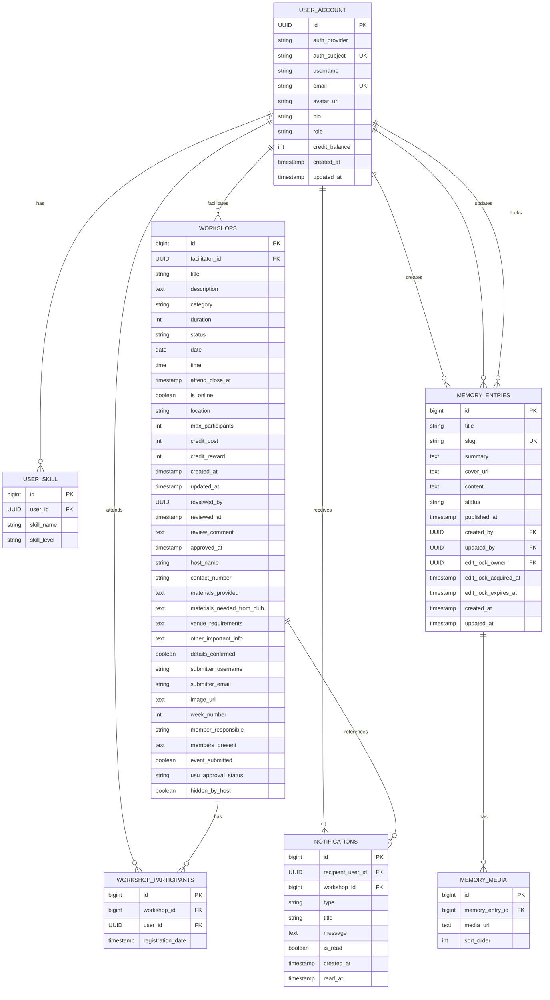

# Database Design

Last reviewed: 2026-05-15

## 1. Document Purpose

This document describes the logical database design, key entities, relationships, and persistence approach for SkillSwap.

It is based on the current repository, including the Project Overview, functional and non-functional requirements, user/admin guides, System Architecture document, README files, backend entities, repositories, services, controllers, DTOs, database scripts, security configuration, storage code, and cloud deployment documentation.

Schema details are labelled conservatively:

| Label | Meaning |
|---|---|
| Code | Directly visible in the current backend implementation. |
| Existing documentation | Stated in current project documentation or deployment documentation. |
| Inferred from implementation | Derived from JPA annotations, repository methods, service logic, or DTO mappings rather than a verified live database inspection. |
| Requires verification | The repository contains incomplete, conflicting, historical, or environment-dependent evidence. |

This document intentionally avoids exposing database credentials, usernames, passwords, connection strings, private infrastructure hostnames, or sensitive account identifiers.

## 2. Database Overview

| Area | Current design | Source |
|---|---|---|
| Database technology | PostgreSQL | Code and existing documentation |
| Persistence framework | Spring Data JPA with Hibernate | Code |
| Production database context | Azure Database for PostgreSQL Flexible Server is documented for deployment | Existing documentation |
| Local development database | A local PostgreSQL profile exists for development | Code |
| Production SSL | Production-oriented configuration and cloud docs use PostgreSQL SSL mode | Existing documentation and code |
| Schema management | JPA/Hibernate validates or maps entities; SQL migrations and schema scripts exist; Flyway runtime execution is disabled in inspected application profiles | Code and requires verification |
| Media storage | PostgreSQL stores media URL references only; uploaded binary files are stored in object storage | Code and existing documentation |

### Schema Management Status

The repository contains multiple forms of schema evidence:

| Evidence | Location | Notes |
|---|---|---|
| JPA entities | `skill-swap-backend/src/main/java/club/skillswap/**/entity` | Current application persistence model. |
| Spring Data repositories | `skill-swap-backend/src/main/java/club/skillswap/**/repository` | Current query and persistence access layer. |
| Flyway migrations | `skill-swap-backend/src/main/resources/db/migration` | Migration files exist for workshop review fields, notifications, roles, memory pages, edit locks, hidden hosted workshops, and cleanup/refactor changes. |
| Manual SQL scripts | `doc/sql` | Includes cleanup of unused historical tables and auth subject/provider support for Clerk-style non-UUID subjects. |
| Schema dump | `skill-swap-backend/src/main/resources/db/schema.sql` | PostgreSQL dump-style schema snapshot. It does not include every latest auth mapping column visible in current entity code and manual SQL. |
| Runtime Flyway flag | `application*.properties` | `spring.flyway.enabled=false` is present in inspected profiles. |

Current conclusion: explicit migration files are present, but automatic Flyway execution is disabled in the inspected runtime properties. The exact production schema application process therefore requires verification. The backend default profile uses Hibernate validation rather than automatic schema creation.

## 3. Persistence Architecture

The backend follows a layered persistence structure:

```text
HTTP request
  -> Controller
  -> DTO binding and Bean Validation where present
  -> Service-level authorization, business rules, and mapping
  -> Spring Data JPA repository
  -> JPA entity
  -> PostgreSQL
```

| Layer | Responsibility | Examples |
|---|---|---|
| Entities/models | JPA persistence model and table mapping | `UserAccount`, `Workshop`, `WorkshopParticipant`, `Notification`, `MemoryEntry`, `MemoryMedia` |
| Repositories | Spring Data JPA access and custom JPQL queries | `UserRepository`, `WorkshopRepository`, `WorkshopParticipantRepository`, `NotificationRepository`, `MemoryEntryRepository` |
| Services | Business rules, authorization, persistence orchestration, notifications, media URL updates | `UserService`, `WorkshopServiceImpl`, `NotificationServiceImpl`, `MemoryServiceImpl` |
| DTOs | API request/response contracts and validation annotations | `WorkshopCreateRequestDto`, `SkillRequestDto`, `MemoryEntryRequestDto`, `WorkshopResponseDto` |
| Controllers | REST endpoints and request binding | `WorkshopController`, `AdminWorkshopController`, `UserController`, `NotificationController`, `MemoryController`, `AdminMemoryController` |
| Security | JWT validation and database-backed admin role mapping | `WebSecurityConfiguration`, `JwtConverter` |
| Storage services | Object storage upload/delete and URL return | `AzureBlobStorageService` |

Data normally enters the system through controllers as JSON DTOs or multipart form data. Services validate ownership, role, status, file type, size, and workflow rules before saving entities through repositories. Response DTOs are mapped from persisted entities and often hide sensitive fields based on viewer role or ownership.

## 4. Entity Relationship Diagram

The ERD below includes only active entities visible in current backend code and supported by schema/migration evidence. Relationships are primarily inferred from JPA `@ManyToOne` / `@OneToMany` annotations and repository usage.

Historical or removed tables are not included, including `user_hidden_hosting_workshops`, `credit_transactions`, `audit_log`, `review`, and `rating_summary`.



Notes:

- The relationship from `WORKSHOPS.reviewed_by` to `USER_ACCOUNT.id` is not modelled as a JPA relationship and no current explicit foreign key was identified in the schema dump. It is documented as a UUID reference field, not as an enforced relationship.
- Cascade and `ON DELETE` behaviour differs between JPA annotations, migration scripts, and the schema dump in some places. See Relationship Documentation for details.

## 5. Table / Entity Catalogue

### 5.1 `user_account` / `UserAccount`

| Item | Details |
|---|---|
| Purpose | Internal application user record mapped to an external authentication subject. |
| Primary key | `id` UUID. Assigned by service logic, not generated by JPA. |
| Important fields | `auth_provider`, `auth_subject`, `username`, `email`, `avatar_url`, `bio`, `role`, `credit_balance`, `created_at`, `updated_at`. |
| Required fields | `username` is non-null in JPA and schema dump. `id` is required as primary key. Other nullability requires verification against the active database. |
| Unique constraints | `email` is unique in JPA and schema dump. `auth_subject` is unique in JPA and the manual auth-subject SQL script. `username` uniqueness is explicitly removed by migrations. |
| Relationships | One user has many `user_skill` rows through `UserAccount.skills`. Other entities reference users as facilitator, participant, notification recipient, memory creator/updater, or edit lock owner. |
| Timestamps | `created_at`, `updated_at` via Hibernate timestamp annotations. |
| Source | Code, schema dump, manual SQL, inferred from implementation. `auth_subject`/`auth_provider` require production schema verification because the main schema dump predates them. |

### 5.2 `user_skill` / `UserSkill`

| Item | Details |
|---|---|
| Purpose | Stores skill labels associated with a user profile. |
| Primary key | `id` bigint identity. |
| Important fields | `user_id`, `skill_name`, `skill_level`. |
| Required fields | `user_id` and `skill_name` are non-null in JPA and schema dump. |
| Foreign keys / relationships | `user_id` references `user_account.id`. Many skills belong to one user. |
| Unique constraints | None identified. |
| Timestamps | None. |
| Source | Code and schema dump; relationship inferred from JPA. |

### 5.3 `workshops` / `Workshop`

| Item | Details |
|---|---|
| Purpose | Stores workshop submissions, scheduling, review status, facilitator association, public display data, admin tracking, and image URL reference. |
| Primary key | `id` bigint identity. |
| Important fields | `facilitator_id`, `title`, `description`, `category`, `duration`, `status`, `date`, `time`, `attend_close_at`, `is_online`, `location`, `max_participants`, `created_at`, `updated_at`, `reviewed_by`, `reviewed_at`, `review_comment`, `approved_at`, `host_name`, `contact_number`, `materials_provided`, `materials_needed_from_club`, `venue_requirements`, `other_important_info`, `details_confirmed`, `submitter_username`, `submitter_email`, `image_url`, `week_number`, `member_responsible`, `members_present`, `event_submitted`, `usu_approval_status`, `hidden_by_host`. |
| Required fields | `facilitator_id`, `created_at`, and `hidden_by_host` are non-null in the current schema evidence. Many business-required fields are enforced at DTO/service level rather than clearly as database `NOT NULL` constraints. |
| Foreign keys / relationships | `facilitator_id` references `user_account.id`. A workshop can have many `workshop_participants` and many related `notifications`. |
| Unique constraints | None identified. |
| Timestamps | `created_at` through JPA auditing; `updated_at` through Hibernate update timestamp. |
| Source | Code, schema dump, migration scripts. Some columns were added through historical migrations. |

### 5.4 `workshop_participants` / `WorkshopParticipant`

| Item | Details |
|---|---|
| Purpose | Join/attendance record linking users to workshops they attend. |
| Primary key | `id` bigint identity. |
| Important fields | `workshop_id`, `user_id`, `registration_date`. |
| Required fields | `workshop_id` and `user_id` are non-null in JPA and schema dump. |
| Foreign keys / relationships | `workshop_id` references `workshops.id`; `user_id` references `user_account.id`. |
| Unique constraints | No explicit unique constraint on `(user_id, workshop_id)` was identified. Duplicate joins are prevented by service logic. |
| Timestamps | `registration_date` is set by service logic on join. |
| Source | Code and schema dump; duplicate-prevention behaviour is application-level. |

### 5.5 `notifications` / `Notification`

| Item | Details |
|---|---|
| Purpose | Stores user-specific notification messages and read state, optionally linked to a workshop. |
| Primary key | `id` bigint identity. |
| Important fields | `recipient_user_id`, `workshop_id`, `type`, `title`, `message`, `is_read`, `created_at`, `read_at`. |
| Required fields | `recipient_user_id`, `type`, `title`, `message`, `is_read`, and `created_at` are non-null in JPA/schema evidence. `workshop_id` and `read_at` are nullable. |
| Foreign keys / relationships | Recipient user is required. Workshop reference is optional. |
| Unique constraints | None identified. |
| Timestamps | `created_at` via JPA auditing; `read_at` set when notification is marked read. |
| Source | Code, schema dump, migration scripts. Delete behaviour requires verification because migration and schema dump evidence differ. |

### 5.6 `memory_entries` / `MemoryEntry`

| Item | Details |
|---|---|
| Purpose | Stores public/admin memory page content, slug, status, publication timestamp, media cover URL, creator/updater references, and draft edit lock metadata. |
| Primary key | `id` bigint identity. |
| Important fields | `title`, `slug`, `summary`, `cover_url`, `content`, `status`, `published_at`, `created_by`, `updated_by`, `edit_lock_owner`, `edit_lock_acquired_at`, `edit_lock_expires_at`, `created_at`, `updated_at`. |
| Required fields | `title`, `slug`, `status`, `created_at`, and `updated_at` are non-null in JPA/schema evidence. |
| Foreign keys / relationships | `created_by`, `updated_by`, and `edit_lock_owner` reference `user_account.id` through JPA relationships. One memory entry has many `memory_media` rows. |
| Unique constraints | `slug` is unique in JPA and schema/migration evidence. |
| Timestamps | `created_at`, `updated_at` via Hibernate timestamp annotations; `published_at` set when publishing; edit lock timestamps set by service logic. |
| Source | Code, schema dump, migration scripts. Active version-based optimistic locking is not present; the historical `version` column is dropped by migration and absent from the entity. |

### 5.7 `memory_media` / `MemoryMedia`

| Item | Details |
|---|---|
| Purpose | Stores ordered media URL references associated with a memory entry. |
| Primary key | `id` bigint identity. |
| Important fields | `memory_entry_id`, `media_url`, `sort_order`. |
| Required fields | `memory_entry_id`, `media_url`, and `sort_order` are non-null in JPA/schema evidence. |
| Foreign keys / relationships | `memory_entry_id` references `memory_entries.id`. Many media rows belong to one memory entry. |
| Unique constraints | None identified. |
| Timestamps | None. |
| Source | Code, schema dump, migration scripts. |

## 6. Relationship Documentation

| Relationship | Type | Ownership / implementation | Cascade or deletion behaviour |
|---|---|---|---|
| `UserAccount` to `UserSkill` | One-to-many / many-to-one | `UserSkill.user` owns the FK through `user_id`; `UserAccount.skills` is the inverse collection. | JPA has `cascade = ALL` and `orphanRemoval = true` for skills. Database `ON DELETE` cascade was not identified in the schema dump. |
| `UserAccount` to `Workshop` | One-to-many / many-to-one | `Workshop.facilitator` owns the FK through `facilitator_id`. | No JPA cascade configured. Database delete implications require verification. |
| `UserAccount` to `WorkshopParticipant` | One-to-many / many-to-one | `WorkshopParticipant.user` owns `user_id`. | No JPA cascade configured. |
| `Workshop` to `WorkshopParticipant` | One-to-many / many-to-one | `WorkshopParticipant.workshop` owns `workshop_id`. | No JPA cascade configured. Admin workshop delete may be blocked by participant FKs unless database behaviour differs. Requires verification. |
| `UserAccount` to `Notification` | One-to-many / many-to-one | `Notification.recipient` owns `recipient_user_id`. | Migration V4 specifies recipient delete cascade, but schema dump does not show `ON DELETE CASCADE`. Requires verification. |
| `Workshop` to `Notification` | One-to-many / many-to-one | `Notification.workshop` owns nullable `workshop_id`. | Migration V4 specifies `ON DELETE SET NULL`, but schema dump does not show it. Requires verification. |
| `UserAccount` to `MemoryEntry` creator/updater/lock owner | Many-to-one references from memory entries | `MemoryEntry.createdBy`, `updatedBy`, and `editLockOwner` reference users. | Migrations specify `ON DELETE SET NULL` for these references, but active database behaviour requires verification. |
| `MemoryEntry` to `MemoryMedia` | One-to-many / many-to-one | `MemoryMedia.entry` owns the FK through `memory_entry_id`; `MemoryEntry.media` is the inverse collection. | JPA has `cascade = ALL` and `orphanRemoval = true`. Migration V6 specifies database cascade, but schema dump does not show `ON DELETE CASCADE`. |

No many-to-many JPA relationships were identified. Attendance is implemented as an explicit join entity, `WorkshopParticipant`.

## 7. User Identity and Authentication Mapping

SkillSwap uses Clerk on the frontend and Spring Security OAuth2 Resource Server on the backend.

| Concept | Implementation | Source |
|---|---|---|
| External identity | JWT `sub` from the authenticated provider. Current docs identify Clerk as active. | Code and existing documentation |
| Internal user row | `UserService.findOrCreateCurrentUser` finds by `user_account.auth_subject`, falls back to UUID subject lookup for legacy compatibility, or creates a new `UserAccount`. | Code |
| Internal primary key | `user_account.id` UUID. For non-UUID subjects, the service creates a random UUID. | Code |
| Auth provider | JWT issuer is stored in `user_account.auth_provider` when available. | Code |
| Email | The service reads email-related JWT claims when present and may store the email if missing locally. | Code |
| Default role | Newly created users are assigned `member`. | Code |
| Admin mapping | `JwtConverter` looks up the local user by `auth_subject` or legacy UUID subject and grants `ROLE_ADMIN` only when `role` normalizes to `admin` or `role_admin`. | Code |

Admin provisioning is not self-service in the application. Existing admin documentation states that assigning or correcting admin roles is a technical maintainer process. Production Clerk cutover documentation notes that Clerk user IDs differ between environments and that seeded admin records may need `auth_subject` remapping. The example in deployment documentation uses placeholder values and should not be treated as seed data.

## 8. Media and File Reference Storage

Uploaded binary files are not stored in PostgreSQL. The database stores URL references returned by object storage.

| Media type | Database reference | Upload service path | Storage behaviour |
|---|---|---|---|
| User avatar | `user_account.avatar_url` | `UserService.uploadCurrentUserAvatar` | Uploads image to Azure Blob Storage under an avatar object path, updates URL, and attempts cleanup of previous Azure Blob URL. |
| Workshop image | `workshops.image_url` | `WorkshopServiceImpl.uploadWorkshopImage` | Admin-only image upload to Azure Blob Storage under a workshop object path, updates URL, and attempts cleanup of previous Azure Blob URL. |
| Memory media | `memory_media.media_url`; `memory_entries.cover_url`; image URLs may also appear in `memory_entries.content` | `MemoryServiceImpl.uploadMemoryMedia` and memory update payloads | Admin-only image upload returns a URL. Memory update stores provided media URL list as `MemoryMedia` rows. Delete attempts to clean up cover/media/content URLs. |

`AzureBlobStorageService` is the active upload implementation for avatar, workshop, and memory uploads. It can return either a plain blob URL or a read-only SAS URL depending on configuration. The old Supabase storage compatibility service has been removed from the backend.

The deployment docs and backend properties use different Azure Blob container environment variable names in places. The exact production container binding requires verification.

## 9. Data Lifecycle

### Users and Skills

- A local `user_account` can be created the first time a valid JWT-backed user profile is resolved.
- Profile updates can change username, avatar URL, bio, and skills.
- Updating skills through the profile update path clears and replaces the JPA `skills` collection.
- Adding a skill normalizes the skill name to lowercase and avoids duplicate skill names for the current in-memory collection.
- Removing a skill deletes matching skill rows through the JPA collection and orphan removal.
- No user deletion endpoint was identified.

### Workshops and Attendance

- Creating a workshop persists a `workshops` row with status `pending`, review metadata cleared, facilitator set, submitter details copied from the current user, `hidden_by_host=false`, and credit values set to zero because the credit system is disabled.
- Public workshop listings query stored status `approved`, then response mapping may compute effective display status such as `upcoming`, `ongoing`, or `completed`.
- Admin approval changes status to `approved`, sets approval/review timestamps, records reviewer UUID, clears review comment, and notifies the facilitator.
- Admin rejection changes status to `rejected`, clears approval timestamp, stores review timestamp/comment/reviewer, and notifies the facilitator.
- Admin cancellation changes status to `cancelled`, stores review timestamp/reviewer, and notifies facilitator and participants where implemented.
- Hosts can hide their own rejected or cancelled workshops by setting `hidden_by_host=true`.
- Joining a workshop creates a `workshop_participants` row after service checks for upcoming status, capacity, attendance close time, and duplicate participation.
- Leaving a workshop hard-deletes matching participation rows.
- A backend admin delete operation exists for workshops. Deletion is a hard delete request through JPA, but actual success with participants/notifications depends on active FK delete behaviour and requires verification.

### Notifications

- Notifications are created asynchronously in new transactions for workshop submission/review/update/cancellation events where services call notification creation.
- Users can list their own notifications, count unread notifications, mark one notification read, or mark all their notifications read.
- No notification deletion endpoint was identified.

### Memories

- Admins can create memory entries. If no slug is provided, service logic generates one from the title.
- Memory statuses supported by service logic are `draft`, `published`, and `archived`.
- Public memory APIs return only `published` entries.
- Draft memory updates and deletion require an active edit lock owned by the acting admin.
- Publishing sets `published_at` if it is not already set.
- Deleting a memory entry is a hard delete through JPA and attempts to delete referenced storage objects.
- Active version-based optimistic locking is not implemented.

## 10. Database Configuration

Relevant non-sensitive configuration:

| Area | Configuration summary |
|---|---|
| DataSource | Spring Boot uses `spring.datasource.url`, `spring.datasource.username`, and `spring.datasource.password`, with production values injected through environment variables or deployment secrets. Values are intentionally omitted here. |
| Production SSL | Production-oriented datasource configuration and deployment docs use PostgreSQL SSL mode. |
| Local development | A local PostgreSQL development profile exists and disables SSL mode. Specific credentials are intentionally omitted. |
| Hibernate | Default profile uses PostgreSQL dialect, `ddl-auto=validate`, SQL logging disabled, and Open Session in View disabled. |
| Development profile | Uses PostgreSQL dialect, `ddl-auto=none`, and Flyway location configuration, but Flyway is disabled. |
| Flyway | Dependencies, Gradle plugin configuration, and migration files exist. Runtime Flyway execution is disabled in inspected profiles. Manual Flyway usage or operational migration process requires verification. |
| Connection pooling | HikariCP pool size and timeout settings are profile-specific. |
| Upload limits | Multipart limits and `app.upload.max-image-bytes` enforce image upload size limits. |
| JWT | Issuer/JWKS/algorithm settings are environment-driven. |
| Blob storage | Azure Blob connection string, container, and SAS validity are environment-driven. Values are omitted. |

## 11. Data Integrity and Validation

### Database-Level Constraints Identified

| Constraint type | Evidence |
|---|---|
| Primary keys | Present in schema dump for all active tables. |
| Foreign keys | Present in schema dump for active relationships between users, workshops, participants, notifications, memory entries, and memory media. |
| Unique email | `user_account.email` is unique in JPA/schema evidence. |
| Unique auth subject | `user_account.auth_subject` is unique in JPA and manual SQL script. Active production schema requires verification because the main schema dump predates this column. |
| Unique memory slug | `memory_entries.slug` is unique in JPA/schema/migration evidence. |
| Non-null fields | Present for selected fields such as primary keys, required FKs, `username`, `memory_entries.title`, `memory_entries.slug`, `memory_entries.status`, notification required fields, and `hidden_by_host`. |

No database `CHECK` constraints were identified for workshop status, memory status, USU approval status, phone number format, positive duration, positive participant count, positive week number, or duplicate attendance prevention.

### Application-Level Validation

| Area | Validation source |
|---|---|
| Workshop creation/update | `WorkshopCreateRequestDto` requires host name, title, category, duration, date, time, `isOnline`, contact number, and details confirmation. It validates Australian 10-digit contact numbers and positive duration/max participants/week number. |
| Workshop status workflows | Service methods restrict approve/reject to pending workshops, prevent editing/cancelling completed/cancelled/started workshops, and compute effective public status from date/time/duration. |
| Attendance | Service logic prevents joining non-upcoming workshops, full workshops, closed attendance, and duplicate joins. |
| User skills | `SkillRequestDto` requires non-blank skill name and limits lengths; service normalizes names. |
| User profile | Service rejects blank username updates. |
| Memory entries | Service requires title on create, normalizes slugs, enforces slug uniqueness through repository checks, restricts status to `draft`, `published`, or `archived`, and enforces edit lock ownership for draft updates/deletes. |
| Media uploads | Services require non-empty files, image content types, valid object paths, and configured maximum sizes. |
| Authorization | Admin role checks and owner checks are enforced in service/controller paths. |

## 12. Indexes and Performance Considerations

Explicit index definitions were found in migration/manual SQL files, but runtime application requires verification because Flyway is disabled in inspected profiles and the schema dump does not show all non-unique migration indexes.

| Index / constraint | Location | Purpose | Status |
|---|---|---|---|
| Primary key indexes | Schema dump | Primary key lookup for all active tables | Confirmed in schema dump |
| `user_account.email` unique constraint | Schema dump and JPA | Email uniqueness | Confirmed in schema dump |
| `memory_entries.slug` unique constraint | Schema dump, JPA, migration | Public memory lookup by slug | Confirmed in schema dump |
| `ux_user_account_auth_subject` | Manual SQL in `doc/sql` | Auth subject lookup and uniqueness | Explicit script; active DB requires verification |
| `idx_workshops_status` | Flyway migration | Workshop status filtering | Explicit migration; active DB requires verification |
| `idx_workshops_facilitator_id` | Flyway migration | Hosted workshop lookup | Explicit migration; active DB requires verification |
| `idx_workshops_updated_at` | Flyway migration | Admin/order/update queries | Explicit migration; active DB requires verification |
| `idx_notifications_recipient_id` | Flyway migration | Notification listing by recipient | Explicit migration; active DB requires verification |
| `idx_notifications_recipient_unread` | Flyway migration | Unread notification count | Explicit migration; active DB requires verification |
| `idx_notifications_created_at` | Flyway migration | Notification ordering | Explicit migration; active DB requires verification |
| `idx_memory_entries_status` | Flyway migration | Public/admin memory status filtering | Explicit migration; active DB requires verification |
| `idx_memory_entries_published_at` | Flyway migration | Public memory ordering | Explicit migration; active DB requires verification |
| `idx_memory_entries_updated_at` | Flyway migration | Admin memory ordering | Explicit migration; active DB requires verification |
| `idx_memory_media_entry_id` | Flyway migration | Loading media for an entry | Explicit migration; active DB requires verification |
| `idx_memory_entries_edit_lock_expires_at` | Flyway migration | Edit lock expiry checks | Explicit migration; active DB requires verification |

Performance notes:

- Repositories use JPQL fetch joins for common facilitator, participant, and user loading paths.
- Participant counts are batched for workshop lists through grouped count queries.
- There is no dedicated search index or full-text search engine. Frontend search/filtering appears to be client-side against loaded workshop data.

## 13. Seed Data and Admin Records

No `data.sql`, active seed fixture, or application startup seed process was identified.

The schema dump contains empty `COPY` sections for active tables, not seed records. Manual SQL scripts contain data backfill/update statements for migration support, not application seed data.

Admin role setup:

- Admin access is based on the local `user_account.role` value.
- Current admin docs state that role provisioning/correction is a technical maintainer process outside the application UI.
- Cloud deployment docs include a placeholder example for remapping an admin record to a production Clerk `auth_subject`. This is operational guidance, not seed data.

## 14. Backup, Migration, and Recovery Considerations

| Area | Current evidence |
|---|---|
| Migration files | Flyway migration files exist under backend resources and manual SQL exists under `doc/sql`. Runtime execution is disabled in inspected application profiles. |
| Schema dump | `schema.sql` exists as a PostgreSQL dump-style snapshot, but it is not fully aligned with the latest auth-subject implementation. |
| Manual database migration | Cloud docs include `pg_dump` and `psql` style export/import guidance for moving data into Azure PostgreSQL. |
| Cleanup backup script | `doc/sql/2026-04-27_cleanup_unused_tables.up.sql` backs up historical unused tables into a `cleanup_backup` schema before dropping them. |
| Automated backups | Automated backup policy, retention period, point-in-time recovery, and restore testing are not documented in the repository. Requires verification. |
| Rollback | Down scripts exist for some manual SQL changes and cleanup scripts, but no complete release rollback or schema rollback runbook was identified. |

Current conclusion: migration and recovery support exists at a basic/manual documentation level, but production-grade backup/restore automation is not proven by repository evidence.

## 15. Known Limitations and Future Improvements

### Current Limitations

- Flyway migrations exist but are disabled at runtime in inspected profiles.
- `schema.sql` appears to be a historical dump and does not include every current entity/manual SQL column, especially auth subject/provider mapping.
- Exact active production schema requires verification against the deployed database.
- Several business rules are enforced at application level rather than database level.
- No database-level unique constraint was identified for `(user_id, workshop_id)` in `workshop_participants`.
- Some migration files define indexes and `ON DELETE` actions that are not visible in the schema dump.
- Admin role provisioning is manual or operational; no admin user-management UI was identified.
- No seed data file was identified.
- Automated backup, restore, and retention policies are not documented.
- Credit-related columns remain, but credit transaction workflows are disabled and historical credit tables were cleaned up.
- Review/rating/audit tables are historical and not active in the current persistence model.

### Future Improvements

- Standardise schema migration execution and document whether Flyway is run manually, through CI/CD, or at application startup.
- Generate a fresh redacted schema snapshot after applying current auth-subject and storage-related changes.
- Add a database-level unique constraint for workshop participation if duplicate attendance must be impossible under concurrent requests.
- Add database-level indexes for frequent auth, notification, workshop, and memory queries if they are not already present in the active database.
- Consider database-level `CHECK` constraints for controlled statuses and positive numeric fields where appropriate.
- Document a formal admin provisioning and identity-remapping process.
- Document automated database backup settings, restore testing, and recovery objectives.
- Define a data retention policy for notifications, cancelled workshops, deleted media references, and inactive users.
- Add integration tests for migrations, relationship constraints, delete behaviours, and auth-subject user mapping.

## 16. Verification Notes

### Directly Supported by Code

- Active JPA entities: `UserAccount`, `UserSkill`, `Workshop`, `WorkshopParticipant`, `Notification`, `MemoryEntry`, `MemoryMedia`.
- Repositories for users, workshops, participants, notifications, and memory entries.
- DTO validation for workshop creation/update and skills.
- Service-level validation for workshop lifecycle, attendance, memory status/slug/edit locks, profile updates, uploads, and admin checks.
- JWT-to-user mapping through `auth_subject`, with legacy UUID fallback.
- Admin authority mapping from `user_account.role`.
- Media URL persistence and Azure Blob Storage upload/delete service usage.
- Memory edit lock model using owner and expiry fields, not JPA `@Version`.

### Directly Supported by Existing Documentation

- PostgreSQL as the relational database.
- Azure Database for PostgreSQL Flexible Server as the documented production database.
- SSL-required production database connection posture.
- Azure Blob Storage as the documented object storage layer.
- Clerk authentication and Clerk subject mapping.
- Manual `pg_dump`/`psql` database migration guidance.
- Manual/operational admin role remapping guidance with placeholder values.

### Explicit SQL Evidence

- `schema.sql` defines the active core tables and most active relationships as of the dump.
- Flyway migrations define additional fields, tables, indexes, and historical schema changes.
- Manual SQL under `doc/sql` adds `auth_provider` and `auth_subject`, creates a unique index on `auth_subject`, and removes historical unused tables after backup.

### Inferred from Implementation

- Logical one-to-many relationships from users to workshops, participants, notifications, and memory entries.
- Data ownership and visibility rules based on service checks.
- Media binary storage outside PostgreSQL, with only URL references persisted.
- Effective workshop statuses such as `upcoming`, `ongoing`, and `completed` are response-level calculations derived from stored status/date/time/duration.

### Requires Verification

- Exact active production DDL, including whether all migrations/manual scripts were applied.
- Whether non-unique indexes from migrations exist in the deployed database.
- Whether migration-defined `ON DELETE` behaviours exist in the deployed database.
- Whether the production database has `auth_provider` and `auth_subject` columns matching current code.
- Whether automated database backups, point-in-time restore, and restore testing are configured outside the repository.
- Exact active Azure Blob container setting because code and deployment docs/workflow use different environment variable names.
