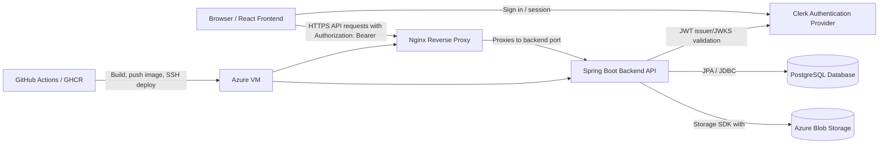

# Security Design

## 1. Document Purpose

This document describes the current security design of SkillSwap based on the repository, backend and frontend implementation, deployment configuration, and existing project documentation.

It covers authentication, authorization, API access control, secret management, network exposure, HTTPS/TLS, database connection security, Azure Blob Storage access, CI/CD secret handling, known risks, and recommended mitigations.

This document is focused on security design. Deployment procedures, API endpoint details, troubleshooting workflows, and general architecture are documented separately in the Deployment Runbook, API Documentation, Troubleshooting Guide, Cloud Deployment documentation, and System Architecture documentation.

## 2. Security Scope

### Covered

- Application security controls implemented in the backend and frontend.
- Authentication and authorization boundaries.
- API access control and route protection.
- JWT validation and Clerk integration.
- Secret and environment variable handling.
- CORS and browser-facing API access.
- Network exposure for the deployed frontend, backend, VM, and reverse proxy.
- HTTPS/TLS design as documented for production deployment.
- Database connection security.
- Azure Blob Storage access model for uploaded media.
- CI/CD and deployment secret handling.
- Known risks, assumptions, limitations, and recommended future improvements.

### Not Covered

- Formal compliance certification.
- Penetration testing results.
- Full threat modelling beyond controls visible in code and documentation.
- Enterprise-grade SIEM, intrusion detection, WAF, or security operations processes unless explicitly present in the repository or documentation.
- Live cloud configuration validation outside the repository.
- Legal privacy compliance claims.

## 3. Security Architecture Summary

SkillSwap uses a browser-based React frontend, Clerk for user authentication, a Spring Boot backend API, PostgreSQL for relational data, Azure Blob Storage for uploaded media, and a Dockerized backend deployment on an Azure VM behind Nginx.

The main security boundaries are:

- **Browser/frontend**: runs the React/Vite application and calls the backend API.
- **Clerk**: external identity provider responsible for user sign-in and JWT issuance.
- **Backend API**: Spring Boot application that validates JWTs and enforces application authorization.
- **PostgreSQL database**: stores application data, including users, workshops, roles, notifications, and media URL references.
- **Azure Blob Storage**: stores uploaded avatar, workshop, and memory media files.
- **Azure VM**: hosts the backend container and Nginx reverse proxy according to deployment documentation.
- **Nginx reverse proxy**: documented production entry point for HTTPS traffic to the backend.
- **GitHub Actions / GHCR**: builds and publishes backend container images, then deploys to the VM by SSH.



### Control Classification

| Classification | Examples in current design |
| --- | --- |
| Implemented security controls | JWT bearer authentication, stateless API sessions, backend route protection, service-layer admin checks, upload size/content-type checks, structured exception handling, Markdown sanitization. |
| Configuration-based controls | Clerk issuer/JWKS settings, RS256 JWT validation configuration, CORS origin list, production datasource SSL mode, multipart limits, Azure Blob Storage container/SAS settings. |
| Operational practices | GitHub Actions secret injection, Vercel environment variables, SSH-based VM deployment, Nginx/Certbot HTTPS setup, Docker log rotation. |
| Known limitations | No documented rate limiting, WAF, centralized security monitoring, automated secret rotation, vulnerability scanning, signed images, formal retention policy, or formal penetration testing. |
| Recommended future improvements | Add rate limiting, stricter upload validation, signed/private media access where needed, audit logging, vulnerability scanning, immutable image tags, monitoring, IaC, backup/restore documentation, and secret rotation. |

## 4. Authentication Design

### Authentication Provider

SkillSwap uses Clerk as the authentication provider.

The frontend initializes Clerk through `ClerkProvider` using a Vite environment variable for the publishable key. This publishable key is intended for browser use and is not equivalent to a backend secret.

The backend is configured as a Spring Security OAuth2 Resource Server and validates JWT bearer tokens issued by Clerk.

### Login and Session Flow

Implemented flow from the inspected frontend code:

1. The user signs in through Clerk UI components in the frontend.
2. Clerk manages the browser-side authentication session.
3. The frontend obtains a Clerk token through the Clerk React hooks.
4. The frontend sends API requests to the backend with:

   ```http
   Authorization: Bearer <JWT_TOKEN>
   ```

5. The backend validates the JWT before allowing access to protected `/api/**` routes.
6. The backend maps the JWT subject to a local `user_account` record through `auth_subject`.

The frontend code requests a Clerk token using a named token template. The exact production Clerk token template configuration is external to this repository and **Requires verification**.

### Development and Production Configuration

The repository contains configuration for local development and production-style deployment:

- The frontend reads Clerk and API configuration from Vite environment variables such as `<CLERK_PUBLISHABLE_KEY>` and `<API_BASE_URL>`.
- The backend reads JWT issuer, JWKS, database, storage, and Clerk secret configuration from environment variables in deployed environments.
- No active `X-Mock-User` workshop creation backdoor remains; local development should use Clerk-issued JWTs like production.

The default backend application configuration includes fallback development values for Clerk issuer/JWKS configuration. Production deployments should provide explicit production values through environment variables and should not rely on defaults.

## 5. JWT Validation

### Implemented Controls

The backend uses Spring Security OAuth2 Resource Server with a custom `NimbusJwtDecoder` configuration.

Verified from backend security configuration:

- JWTs are read from the `Authorization` header as bearer tokens.
- The backend can validate tokens using a configured JWKS endpoint:

  ```text
  <CLERK_JWKS_URI>
  ```

- If a JWKS endpoint is not configured, the decoder can be built from the configured issuer location:

  ```text
  <CLERK_ISSUER_URI>
  ```

- The default backend configuration sets the expected signing algorithm to `RS256`.
- If an issuer is configured, Spring's default issuer validator is applied.
- Sessions are configured as stateless for API requests.

### Framework-Handled Behaviour

JWT signature verification, expiry validation, and issuer validation are handled by Spring Security and Nimbus JOSE/JWT framework behaviour when the relevant configuration is present.

The repository does not show custom audience validation. If Clerk audience restrictions are required, that should be added explicitly or verified in framework/provider configuration.

### Placeholders

Do not document or commit real JWTs. Use:

```http
Authorization: Bearer <JWT_TOKEN>
```

Production JWT configuration should use:

```text
CLERK_ISSUER_URI=<CLERK_ISSUER_URI>
CLERK_JWKS_URI=<CLERK_JWKS_URI>
CLERK_SECRET_KEY=<CLERK_SECRET_KEY>
```

`CLERK_SECRET_KEY` is present in backend configuration and deployment secrets. Direct use of this secret in backend service logic was not identified during this review, so its runtime purpose **Requires verification**.

## 6. Authorization and Role-Based Access Control

### Implemented Controls

Authorization is enforced through a combination of:

- Spring Security route protection.
- Spring method security support.
- Backend service-layer role checks.
- Local database role mapping from the `user_account.role` field.
- Ownership and visibility checks in service methods.

The backend enables method security. The inspected controller code includes at least one `@PreAuthorize("hasRole('ADMIN')")` admin endpoint. Most admin enforcement is implemented in service-layer checks rather than controller annotations.

### User Roles

The database model includes a user role field. New users are created with a default member role.

Admin authority is inferred from implementation by mapping local database role values to Spring authorities:

- `admin`
- `role_admin`

These values are normalized by backend code and mapped to `ROLE_ADMIN`.

### Admin Access

Implemented admin controls include:

- Admin-only hello/test endpoint through method security.
- Admin workshop listing and moderation actions through service-layer `requireAdmin` checks.
- Workshop delete through an explicit admin check in the workshop service.
- Admin memory listing, creation, update, deletion, locking, and media upload through service-layer admin checks.

Partially supported / Requires verification:

- Admin provisioning appears to be a maintainer or database-level process rather than a complete in-app admin user management workflow.
- The frontend checks for `role === "admin"` for admin UI state, while the backend also accepts `role_admin`. This may cause UI visibility differences for users whose database role is stored as `role_admin`.
- The admin workshop detail route uses the general workshop detail service path, which applies visibility and sensitive-field checks but does not show the same explicit `requireAdmin` call as other admin workshop methods. The intended access semantics for this endpoint should be verified.

### Frontend Role Checks

Frontend admin checks are used for UI state and navigation. They are not a security boundary. Backend authorization must remain the source of truth for protected operations.

## 7. API Security

### Public and Protected Routes

Implemented route policy from Spring Security configuration:

| Route area | Access model |
| --- | --- |
| `/health` | Public |
| `/api/health` | Public |
| `GET /api/v1/workshops` | Public at route level, with response behaviour affected by authentication/admin state |
| `GET /api/v1/workshops/public` | Public |
| `GET /api/v1/workshops/{id}` | Public at route level for numeric workshop IDs, with backend visibility checks |
| `GET /api/v1/memories` | Public |
| `GET /api/v1/memories/{slug}` | Public |
| Other `/api/**` routes | Authenticated |

Some public route patterns are broad enough that service-level checks remain important. For example, workshop routes such as `/mine` and `/attending` are protected by controller/service authentication checks even though the GET workshop route pattern is public at the Spring Security route layer.

### Input Validation

Implemented validation includes:

- Bean Validation annotations on several request DTOs.
- Service-level validation for workshop status transitions and memory entry fields.
- Upload checks for required file presence.
- Upload size limits for image uploads.
- Upload content type checks for avatar, workshop, and memory media uploads.
- Multipart upload limits in Spring configuration.

Limitations:

- Upload validation is based primarily on content type and size. No malware scanning, image content validation, content moderation, or image dimension validation was identified.
- Some request validation is implemented in service code rather than uniformly through DTO annotations.

### Error Handling

The backend includes a global exception handler that returns structured error responses for common application exceptions, validation failures, multipart upload errors, data conflicts, and generic server errors.

Security authentication failures generated directly by Spring Security may be handled by Spring Security defaults rather than the application `GlobalExceptionHandler`.

The default application configuration disables stacktrace inclusion in error responses. Development configuration enables more detailed error output and should not be used in production.

### CORS

Implemented CORS configuration includes:

- Explicit allowed origins for local development and documented deployed frontend origins.
- Allowed methods: `GET`, `POST`, `PUT`, `PATCH`, `DELETE`, `OPTIONS`.
- Allowed request headers: all.
- Credentials allowed.
- Exposed response headers include `Authorization` and `Content-Type`.

The exact production origin list should be verified against the deployed frontend domains.

### Controls Not Identified

The repository does not show implemented rate limiting, request throttling, WAF protection, API gateway enforcement, CSRF tokens for browser form posts, or bot protection. CSRF protection is disabled in backend security configuration, which is typical for a stateless bearer-token API but should be revisited if cookie-based backend sessions are introduced.

## 8. Frontend Security Considerations

### Implemented Integration

The frontend integrates with Clerk using Clerk React components and hooks. It obtains a token from Clerk and passes it to the backend API through the `Authorization` header.

The frontend API client:

- Reads the backend base URL from a Vite environment variable.
- Adds `Authorization: Bearer <JWT_TOKEN>` when a token is supplied.
- Handles JSON and `FormData` requests.
- Resolves API-relative asset URLs against the configured API base URL.

### Environment Variables

Frontend configuration includes browser-exposed values such as:

```text
VITE_API_BASE_URL=<API_BASE_URL>
VITE_CLERK_PUBLISHABLE_KEY=<CLERK_PUBLISHABLE_KEY>
```

Values prefixed with `VITE_` are compiled into the frontend bundle and must be treated as public. Backend secrets, database credentials, storage connection strings, and private keys must not be placed in frontend environment variables.

### Client-Side Limitations

The frontend decodes JWT payloads for client-side profile/cache fallback behaviour. This decoding is not token validation and is not a security control.

The frontend stores user profile/cache data in browser storage. The inspected code does not explicitly store Clerk bearer tokens in local storage, but Clerk's internal session storage behaviour is managed by Clerk and should be reviewed against Clerk production configuration.

Frontend checks for admin UI state are convenience checks only. Backend authorization is required for all protected operations.

## 9. Secret Management

### Runtime Secrets

Backend production secrets are expected to be injected through environment variables or GitHub Actions deployment secrets rather than committed source code.

Sensitive runtime values include:

| Area | Placeholder / variable |
| --- | --- |
| Database URL | `<DB_URL>` |
| Database username | `<DB_USERNAME>` |
| Database password | `<DB_PASSWORD>` |
| Clerk issuer | `<CLERK_ISSUER_URI>` |
| Clerk JWKS endpoint | `<CLERK_JWKS_URI>` |
| Clerk backend secret | `<CLERK_SECRET_KEY>` |
| Azure Storage connection string | `<AZURE_STORAGE_CONNECTION_STRING>` |
| SSH private key | `<SSH_PRIVATE_KEY>` |
| VM host and user | `<AZURE_VM_IP>`, `<AZURE_VM_USER>` |

The repository-level and module-level ignore files include rules intended to prevent `.env` files, private keys, local secrets, logs, and database dumps from being committed.

### GitHub Actions Secrets

The backend deployment workflow reads deployment values from GitHub Actions secrets and passes them into the running Docker container as environment variables.

Secrets used by deployment include database credentials, Azure Blob Storage connection string, Clerk configuration, and SSH credentials for the VM.

### Frontend Deployment Configuration

Frontend deployment configuration should use only browser-safe public values, such as the API base URL and Clerk publishable key. Production-sensitive values must not be configured as `VITE_` variables.

### Current Limitations

- Automated secret rotation is not documented.
- Secret expiry or rotation ownership is not documented.
- The local development profile expects the database password through `DEV_DB_PASSWORD`; local `.env` files should remain untracked.
- The backend Gradle `bootRun` task includes diagnostic output that previews the database password variable. This should be removed or restricted to avoid accidental exposure in logs.
- Some cloud documentation includes concrete infrastructure identifiers. Security handover documents should continue to use placeholders instead of real values.

## 10. Network Security

### Documented Public Surface

Existing deployment documentation describes the following production network model:

- Public frontend hosted by Vercel.
- Public HTTPS API endpoint routed through Nginx.
- HTTP traffic redirected to HTTPS.
- SSH access to the Azure VM for deployment and maintenance.
- Backend Spring Boot application listening on port `8080` inside the VM/container environment.
- Nginx reverse proxy forwarding HTTPS requests to the backend application.

### Network Security Group / Firewall

Cloud deployment documentation describes inbound exposure for:

- `22` for SSH.
- `80` for HTTP.
- `443` for HTTPS.

The same documentation states that backend port `8080` is not publicly exposed. However, the deployment workflow maps the Docker container port to the host with `-p 8080:8080`. Therefore, public non-exposure of port `8080` depends on the VM firewall or Azure Network Security Group being configured as documented.

This is **Requires verification** in the live Azure environment.

### Nginx Reverse Proxy

Nginx is documented as the public reverse proxy for the backend API. It terminates or handles public HTTPS traffic and forwards requests to the backend container.

The repository does not include a complete live Nginx configuration file. Specific proxy headers, timeout rules, body-size limits, and hardening settings should be verified on the VM.

## 11. HTTPS / TLS Design

### Documented Design

Production HTTPS is documented as being provided through Nginx with Let's Encrypt / Certbot certificates.

Documented behaviour includes:

- Public API traffic uses HTTPS.
- HTTP traffic is redirected to HTTPS.
- TLS termination is handled at Nginx before proxying to the backend service.
- Vercel provides HTTPS for the frontend deployment.

### Limitations

The repository and documentation reviewed do not show explicit configuration for:

- HSTS.
- TLS version enforcement.
- Custom cipher policy.
- Certificate pinning.
- mTLS.
- Automated certificate renewal monitoring.

Certificate issuance and renewal are documented operationally, but the live certificate and renewal state **Require verification**.

## 12. Database Security

### Implemented and Documented Controls

SkillSwap uses PostgreSQL through the backend application. The cloud architecture documentation describes Azure Database for PostgreSQL Flexible Server for production.

Verified from backend configuration and deployment documentation:

- Backend database credentials are supplied through environment variables in deployment.
- The default backend datasource URL includes SSL mode requirements for production-style configuration.
- Application code accesses the database through Spring Data JPA repositories and service-layer logic.
- User roles and authentication subject mappings are stored in the application database.
- Uploaded media content is stored in object storage; database records store URLs/references rather than binary file content.

### Application-Level Mediation

Client applications do not connect directly to PostgreSQL. Application data access is mediated by the backend API and service layer.

### Limitations

The repository does not document or implement:

- Row-level security.
- Application-side field-level encryption.
- Private database endpoint enforcement.
- Database audit logging.
- A verified backup and restore process.
- Point-in-time recovery validation.

Azure-managed platform features may exist, but they should not be claimed as implemented project controls unless confirmed in the live cloud configuration.

## 13. Azure Blob Storage Security and Access Model

### Implemented Storage Use

The backend stores user-uploaded media in Azure Blob Storage through the Azure Storage SDK.

Implemented upload areas include:

- User avatar images.
- Workshop images.
- Memory media images.

The backend writes objects using an Azure Storage connection string:

```text
AZURE_STORAGE_CONNECTION_STRING=<AZURE_STORAGE_CONNECTION_STRING>
```

The backend stores returned blob URLs in the database and returns those URLs to the frontend as part of API responses.

### Access Model

Existing cloud deployment documentation describes the blob container access model as public read with authenticated write.

Inferred from implementation:

- Backend write access is controlled by the storage connection string.
- Plain blob URLs are returned when the configured SAS validity period is zero or absent.
- The backend can append a read-only SAS URL when SAS validity days are configured above zero.

Requires verification:

- Whether the active production container is public-read or private.
- Whether production uses plain public blob URLs or SAS URLs.
- Whether the deployment environment variable naming matches the backend property name. The deployment workflow currently uses a container-related variable name that differs from the backend property name documented in application configuration.

### Limitations

The repository does not show implemented:

- Malware scanning for uploaded files.
- Private-container signed URL flow as the documented production default.
- File content validation beyond size and content type.
- Content moderation for uploaded images.
- Lifecycle retention policy for uploaded files.

Public blob access is appropriate only for media intended to be publicly visible. If private user media is added, the access model should be changed.

## 14. CI/CD and Deployment Security

### Implemented Deployment Flow

The backend deployment workflow:

1. Runs on pushes to the main branch.
2. Builds the Spring Boot backend JAR.
3. Builds a Docker image.
4. Authenticates to GitHub Container Registry using GitHub-provided credentials.
5. Pushes the backend image using a `latest` tag.
6. Connects to the Azure VM over SSH using a private key stored as a GitHub Actions secret.
7. Pulls and runs the backend container on the VM.
8. Injects production configuration as container environment variables.
9. Configures Docker log rotation for the backend container.
10. Uses a Docker restart policy for container availability.

### Secret Handling

Deployment secrets are stored in GitHub Actions secrets and passed to the VM deployment command at runtime. They are not intended to be committed to the repository.

### GHCR Authentication

The workflow uses GitHub Container Registry for backend image publishing. Authentication is performed in GitHub Actions and again on the VM before pulling the image.

### Limitations and Risks

- The deployment uses a `latest` image tag, which limits deterministic rollback.
- No signed container image process was identified.
- No container vulnerability scanning workflow was identified.
- No SAST or dependency security scanning workflow was identified.
- No Infrastructure as Code definition was identified for the production VM, Nginx, NSG, database, or storage resources.
- SSH deployment gives the workflow operational access to the VM. Key protection and least privilege should be reviewed.
- Branch protection rules are not visible from repository contents and therefore **Require verification**.

The repository also contains AI pull-request review workflows that use API keys from GitHub secrets. These workflows are quality automation and should not be treated as production security scanning controls.

## 15. Container and VM Security Considerations

### Implemented / Documented

The backend is containerized with a Java 17 runtime image and runs the Spring Boot JAR inside Docker.

Deployment documentation describes:

- Backend running in Docker on an Azure VM.
- Nginx running as the public reverse proxy on the VM.
- Container restart policy configured as `unless-stopped`.
- Docker JSON log rotation with capped file size and file count.

### Limitations

The Dockerfile does not show:

- A non-root container user.
- Explicit filesystem hardening.
- Read-only root filesystem.
- Dropped Linux capabilities.
- Image signature verification.
- Vulnerability scanning.

The repository does not document:

- Automated OS patching for the VM.
- Host intrusion detection.
- Centralized VM security monitoring.
- VM backup or rebuild automation.

VM resource constraints are documented as operational concerns. Resource exhaustion can become an availability risk, especially for upload handling and traffic spikes.

## 16. Data Protection and Privacy Considerations

### Data Types Handled

Based on the code and database documentation, SkillSwap handles:

- Clerk authentication subject identifiers.
- User profile data such as display name, username, email, bio, role, avatar URL, and skills.
- Workshop data such as title, description, category, facilitator, schedule, location/online status, contact information, status, participants, and media URL.
- Notification records associated with users.
- Memory entries, slugs, Markdown content, status, editor lock metadata, and media URLs.
- Operational metadata such as timestamps and audit-style created/updated fields.

### Identity and Media Storage

Clerk manages authentication identity externally. The backend stores the Clerk subject and provider metadata to link authenticated users to local application records.

Uploaded media is stored in Azure Blob Storage. Database records store media URLs or references rather than binary file content.

### Implemented Data Access Protections

Implemented or inferred from implementation:

- Public workshop and memory views limit access to public/published content.
- Workshop detail mapping avoids returning sensitive fields to users who are not admin users or workshop facilitators.
- Notification queries are scoped to the authenticated recipient.
- Admin memory and workshop operations require admin authorization in service methods.
- Markdown memory content is rendered on the frontend through a sanitization pipeline.

### Limitations

The repository does not document:

- Formal data retention policy.
- User data export process.
- Complete user deletion process.
- Legal compliance certification.
- Administrative audit log for sensitive actions.
- Formal privacy review for uploaded public media.

No GDPR, CPRA, HIPAA, SOC 2, ISO 27001, or other compliance status should be claimed from the current repository evidence.

## 17. Threats, Risks, and Mitigations

| Risk | Impact | Existing mitigation | Current limitation | Recommended future improvement |
| --- | --- | --- | --- | --- |
| Leaked backend secrets | Database, Clerk, storage, or VM access could be compromised. | Production secrets are expected to be stored in GitHub Actions, Vercel, and runtime environment variables. `.env` files and key files are ignored by module ignore rules. | Automated rotation is not documented. Some local/dev configuration hygiene issues exist. | Add a documented secret rotation process, remove diagnostic password preview logging, and review least-privilege credentials. |
| Incorrect Clerk production configuration | Valid users may be rejected, or tokens from the wrong issuer could be accepted if production falls back to development values. | Backend validates JWTs using configured issuer/JWKS and RS256. | Default development issuer/JWKS values exist in application configuration. Live Clerk settings require verification. | Add production config validation that fails startup when production Clerk values are missing or mismatched. |
| JWT issuer mismatch | Authenticated API calls fail with 401 responses. | Spring issuer validation is configured when issuer URI is supplied. | Exact production token template and issuer values are external to the repository. | Add deployment smoke tests that verify a production Clerk token against `/api/v1/users/me`. |
| Publicly exposed backend port | Clients could bypass Nginx HTTPS controls and reach the backend directly. | Deployment docs state only SSH, HTTP, and HTTPS are exposed publicly. | Docker maps host port `8080`; protection depends on live NSG/firewall state. | Bind backend only to localhost/private network or explicitly block `8080` at host and cloud firewall layers. |
| Public blob access | Anyone with a blob URL can read public media. | Public-read media is documented for user-facing uploaded images. Backend writes require storage credentials. | Private containers or signed URLs are not documented as the active default. | Use private containers and short-lived signed URLs for non-public media. |
| Weak admin role mapping | Incorrect database role values could grant or hide admin capabilities. | Backend maps local roles to `ROLE_ADMIN` and performs service-layer checks. | Admin provisioning process and audit trail are not fully documented. Frontend admin UI checks only `admin`. | Add explicit admin management process, audit logs, role tests, and align frontend/backend role normalization. |
| Missing rate limiting | Login-adjacent and API endpoints may be more exposed to abuse or brute-force traffic patterns. | Clerk handles authentication UI/provider-side protections. Backend validates JWTs and inputs. | No backend or reverse-proxy rate limiting is documented. | Add API rate limiting at Nginx or application layer, especially for uploads and write endpoints. |
| Missing formal monitoring/alerting | Security incidents and availability issues may be detected late. | Application and Docker logs exist; health endpoint exists. | No centralized logging, alerting, or SIEM is documented. | Add centralized logs, metrics, alerting, and security-relevant dashboards. |
| Manual SSH-based deployment risk | Compromised CI secrets or deployment mistakes could affect the VM. | SSH private key is stored as a GitHub secret and deployment is automated. | SSH key scope, VM user privileges, and key rotation are not documented. | Use least-privilege deploy user, rotate keys, consider OIDC or managed deployment, and document emergency access. |
| Limited rollback/versioning | Failed deployment may be harder to roll back deterministically. | Containerized deployment can pull and run images. | Workflow pushes and deploys only `latest`. | Publish immutable image tags using commit SHA and document rollback commands. |
| Storage container environment mismatch | Uploaded files may go to the wrong container or fall back to defaults. | Backend has configurable Azure Blob container property. | Deployment workflow variable name differs from backend property naming. | Align environment variable names and add startup logging that reports non-sensitive storage configuration. |
| Missing upload malware scanning | Malicious files could be uploaded if accepted by content type and size checks. | Backend restricts uploads by size and content type. | No malware scanning or deep content validation was identified. | Add scanning, safer MIME detection, file extension normalization, and stricter image validation. |
| Missing admin audit logging | Unauthorized or mistaken admin actions may be hard to investigate. | Admin actions are protected by role checks. | No structured audit log for admin moderation actions was identified. | Record actor, action, target, timestamp, and outcome for admin operations. |

## 18. Security Assumptions

The current design relies on the following assumptions:

- Clerk correctly issues, signs, and expires JWTs for the configured production application.
- Production `CLERK_ISSUER_URI` and `CLERK_JWKS_URI` match the Clerk instance used by the frontend.
- GitHub Actions secrets remain protected and are only accessible to trusted workflows and maintainers.
- Vercel frontend environment variables contain only browser-safe values.
- The Azure VM SSH private key is protected and rotated when needed.
- Production database credentials are supplied through secret stores or runtime environment variables.
- Nginx continues to route public HTTPS traffic to the backend and HTTP continues to redirect to HTTPS.
- Backend port `8080` is not publicly reachable from the internet.
- Azure Network Security Group and host firewall configuration match the deployment documentation.
- Azure PostgreSQL SSL settings match the documented production connection model.
- Azure Blob Storage container access matches the intended media access model.
- Local database roles accurately represent application permissions.
- Live cloud infrastructure has not drifted from the documented deployment model.

## 19. Known Limitations

- No formal penetration testing is documented.
- No documented backend or reverse-proxy rate limiting.
- No documented WAF or API gateway.
- No documented centralized security monitoring, alerting, or SIEM.
- No documented automated secret rotation.
- No documented dependency, SAST, or container vulnerability scanning.
- No documented signed container images.
- No documented private blob access or signed URL flow as the active default.
- No documented formal data retention policy.
- No documented user data export process.
- No complete documented user deletion workflow.
- No documented admin audit logging.
- No documented automated database migration step in production deployment.
- No verified database backup and restore procedure in the repository.
- No documented Infrastructure as Code for cloud resources.
- No documented VM OS patch automation.
- Production Nginx, NSG, Certbot, and cloud resource settings require live verification.

## 20. Recommended Future Improvements

Future work should be tracked separately from implemented controls:

- Add backend or Nginx rate limiting for API write endpoints, uploads, and authentication-adjacent flows.
- Add stricter file upload validation, including MIME sniffing, extension controls, image parsing, and malware scanning.
- Use private blob containers and signed URLs for media that should not be public.
- Add structured audit logging for admin actions.
- Align frontend and backend admin role normalization.
- Add dependency, SAST, and container vulnerability scanning to CI.
- Publish immutable container image tags using commit SHA or release version.
- Add a safer rollback procedure for backend deployments.
- Add centralized logging, metrics, uptime checks, and security alerting.
- Add Infrastructure as Code for Azure VM, NSG, PostgreSQL, Blob Storage, and Nginx-related configuration.
- Add a documented backup and restore procedure for PostgreSQL.
- Add a documented secret rotation process.
- Remove local/dev hardcoded credentials and diagnostic password preview logging.
- Add startup validation for required production secrets and Clerk configuration.
- Add deployment smoke tests for Clerk JWT validation and protected API access.
- Consider binding the backend container only to localhost or a private Docker network behind Nginx.
- Document admin provisioning, emergency access, and permission review processes.

## 21. Verification Notes

### Directly Verified from Code and Configuration

The following were verified from repository code/configuration:

- Spring Security OAuth2 Resource Server setup.
- JWT decoder configuration using issuer/JWKS and RS256 configuration.
- Stateless backend session policy.
- Spring route-level public/protected API rules.
- Method security enablement.
- Backend role-to-authority mapping using local database roles.
- Service-layer admin checks for workshop and memory administration.
- Service-layer ownership and visibility checks for workshops, notifications, and memory editing.
- CORS configuration.
- DTO and service-level validation patterns.
- Multipart upload limits and upload content type/size checks.
- Azure Blob Storage upload/delete service implementation.
- Frontend Clerk provider integration.
- Frontend API client bearer-token usage.
- Frontend public environment variable usage.
- Dockerfile runtime image and exposed backend port.
- GitHub Actions backend build, GHCR push, SSH deployment, environment variable injection, and Docker log rotation.

### Supported by Existing Documentation

The following are supported by existing project documentation:

- Vercel frontend deployment model.
- Azure VM backend deployment model.
- Nginx reverse proxy and HTTPS entry point.
- Let's Encrypt / Certbot certificate management.
- Azure Database for PostgreSQL production database target.
- Azure Blob Storage media storage target.
- Public-read blob media model.
- Documented network exposure for SSH, HTTP, and HTTPS.
- GitHub Actions deployment secret names.
- Troubleshooting guidance indicating lack of centralized monitoring and need for live infrastructure verification.

### Inferred from Implementation

The following are inferred from implementation and should be treated as implementation-backed but not separately documented controls:

- Backend authorization is the true security boundary for admin actions, while frontend admin state only affects UI.
- Blob URLs returned by backend responses are intended to be consumed directly by the frontend.
- Notification access is scoped to the authenticated user through recipient-based queries.
- Workshop sensitive-field exposure is limited through DTO mapping based on admin/facilitator checks.
- Clerk token storage is primarily managed by Clerk; the inspected application code does not explicitly persist bearer tokens in local storage.

### Requires Further Verification

The following require live environment or provider-dashboard verification:

- Production Clerk issuer, JWKS, signing algorithm, and token template configuration.
- Whether `CLERK_SECRET_KEY` is required by the running backend or retained for future/provider-side use.
- Production CORS origin list.
- Live Nginx reverse proxy configuration.
- Certbot renewal status and active certificate configuration.
- Azure NSG and host firewall rules, especially whether port `8080` is unreachable publicly.
- Azure Blob Storage container access level and whether SAS URLs are enabled in production.
- Alignment between deployment environment variable names and backend Azure Blob configuration.
- Production PostgreSQL SSL enforcement, backup settings, and restore testing.
- Branch protection and workflow approval rules in GitHub.
- Admin provisioning and permission review process.
- Any monitoring, alerting, vulnerability scanning, or operational controls configured outside the repository.
