# System Architecture

Last reviewed: 2026-05-13

## 1. Document Purpose

This document describes the application-level architecture of SkillSwap. It explains how the React frontend, Spring Boot backend, PostgreSQL data model, Clerk authentication, media storage, and deployment environment work together.

This document is intended for portfolio review, technical handover, and future maintainers. It summarises deployment context only where it helps explain the application architecture. Detailed cloud deployment procedures remain covered by the separate cloud deployment documentation.

## 2. Architecture Summary

SkillSwap is implemented as a decoupled full-stack web application.

| Layer | Current implementation | Source |
|---|---|---|
| Frontend | React 18 + TypeScript + Vite single-page application | Code |
| UI and styling | Tailwind CSS, Radix UI components, custom CSS, Lucide icons, Sonner notifications | Code |
| Authentication UI/session | Clerk React SDK | Code and existing documentation |
| Backend | Java 17 Spring Boot 3 application exposing REST APIs | Code |
| Backend security | Spring Security OAuth2 Resource Server with JWT issuer/JWKS validation | Code |
| Database | PostgreSQL via Spring Data JPA/Hibernate | Code and existing documentation |
| Media storage | Azure Blob Storage service for uploaded media; legacy Supabase storage service remains in code for cleanup compatibility | Code and existing documentation |
| Deployment | Frontend on Vercel; backend as a Dockerised Spring Boot service on an Azure VM behind Nginx and HTTPS/TLS | Existing documentation and workflow files |
| CI/CD | GitHub Actions builds the backend JAR, builds and pushes a Docker image to GHCR, then redeploys on the Azure VM | Workflow files and existing documentation |

## 3. High-Level System Architecture

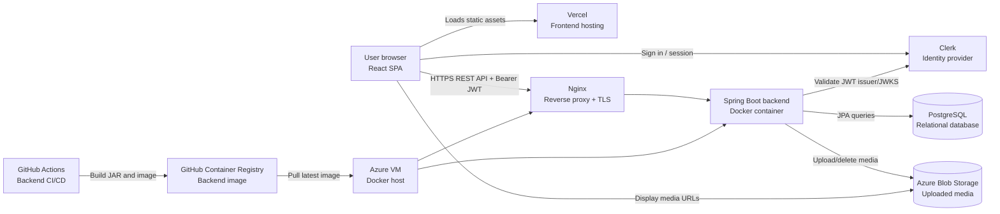

### Component Responsibilities

| Component | Responsibility | Notes |
|---|---|---|
| React SPA | Presents user and admin workflows, manages page navigation, calls backend APIs, renders public and authenticated views | Uses an internal page-state router mapped to browser paths rather than React Router |
| Clerk | Handles sign-in, sign-up, OAuth/session management, and token issuance | Authentication options depend on Clerk project configuration |
| Spring Boot API | Owns business logic, validation, authorization, persistence, notification creation, and media upload orchestration | REST API under `/api/v1` |
| PostgreSQL | Stores users, skills, workshops, participants, notifications, memory entries, and memory media references | Managed PostgreSQL in deployment docs |
| Azure Blob Storage | Stores uploaded avatars, workshop images, and memory media | Backend returns media URLs to the frontend |
| Nginx | Terminates HTTPS and proxies backend traffic to the Spring Boot container | Deployment detail from cloud docs |
| GitHub Actions + GHCR | Builds and deploys backend container images | Not part of runtime request handling |

## 4. Frontend Architecture

### Framework and Structure

The frontend is a React 18, TypeScript, and Vite application located under `skill-swap-frontend`.

| Area | Implementation | Source |
|---|---|---|
| Entry point | `main.tsx` renders the React app inside `ClerkProvider` | Code |
| Main shell | `App.tsx` lazy-loads major screens and renders the selected page | Code |
| Application context | `contexts/AppContext.tsx` owns global app state, authentication status, current page, workshop cache, notification count, and user profile actions | Code |
| Feature structure | Feature folders under `components`, with screens, hooks, components, constants, models, and utilities | Code |
| Shared API services | `shared/service` and `lib/api.ts` contain backend API wrappers and mapping helpers | Code |

### Routing Structure

The frontend uses an internal page identifier and browser history mapping pattern. This is inferred from `AppContext.tsx`.

| Path | Page identifier | Screen / behaviour | Source |
|---|---|---|---|
| `/` | `hero` | Landing screen | Code |
| `/home` | `home` | Archive/home view | Code |
| `/explore` | `explore` | Workshop browsing | Code |
| `/workshops/{id}` | `workshop-{id}` | Workshop detail view | Code |
| `/create` | `create` | Workshop submission form | Code |
| `/dashboard` | `dashboard` | Profile, hosted workshops, and attended workshops | Code |
| `/memory` | `memory` | Public memory wall | Code |
| `/memory/{slug}` | memory detail page | Public memory entry detail | Code |
| `/admin/workshops` | `adminReview` | Admin workshop review screen | Code |
| `/admin/memory` | `adminMemory` | Admin memory studio | Code |
| `/notifications` | `notifications` | User notification inbox | Code |
| `/auth` | `auth` | Clerk sign-in/sign-up screen | Code |
| `/feedback` | `feedback` | Placeholder screen only | Code |
| `/credits` | `credits` | Redirects to dashboard because the credit system is disabled | Code |

### Key Feature Areas

| Feature area | Frontend implementation | Status |
|---|---|---|
| Authentication | Clerk provider, auth screen, auth redirects, session token handling | Supported |
| Workshop discovery | Explore workshop screen, filters, detail page, public API service | Supported |
| Workshop creation | Create workshop screen, validation helpers, create API service | Supported |
| Attendance | Join and leave actions through workshop mutation service | Supported |
| Dashboard | Profile card, profile edit dialog, hosted and attended workshop views | Supported |
| Notifications | Notification list, unread count, mark-read actions | Supported |
| Memory pages | Public memory wall and detail pages, Markdown rendering with sanitisation | Supported |
| Admin workshop review | Admin list/detail workflow, approval/rejection/cancellation, image upload | Supported for admin users |
| Admin memory studio | Admin CRUD, media upload, edit locks | Supported for admin users |
| Feedback/ratings | Placeholder only | Not currently implemented |
| Credits | Historical fields exist, but current frontend comments indicate credit transactions are disabled | Partially supported / disabled |

### API Communication Pattern

The frontend uses service modules rather than calling `fetch` directly from most screens.

| Concern | Implementation | Source |
|---|---|---|
| Base API helper | `apiCall<T>()` in `lib/api.ts` | Code |
| Base URL | Environment-driven API base URL with a local fallback | Code |
| Authenticated requests | Adds `Authorization: Bearer <token>` when a Clerk token is available | Code |
| JSON requests | Sets `Content-Type: application/json` when request body is not `FormData` | Code |
| File uploads | Sends `FormData` without forcing JSON headers | Code |
| Response mapping | Frontend mapping utilities normalise backend fields into TypeScript view models | Code |
| Error handling | Non-OK responses are converted into thrown errors with status information where available | Code |

### Frontend Authentication Integration

The frontend wraps the app in Clerk's `ClerkProvider`. `AppContext.tsx` uses Clerk hooks to determine whether a user is signed in, retrieves a session token, and fetches the backend profile from `/api/v1/users/me`.

The frontend derives `isAdmin` from the backend profile role rather than from a hard-coded client-side allowlist. This is important because the backend remains the authorization authority for protected admin actions.

### State Management Approach

State management is implemented with React Context, React hooks, local component state, `localStorage`, and `sessionStorage`.

No Redux, Zustand, server-state cache library, or GraphQL client was found in the inspected code. This is inferred from implementation.

### Styling and UI Approach

The frontend uses Tailwind CSS, custom CSS files, Radix UI primitives, Lucide icons, and Sonner toasts. Memory content rendering uses `react-markdown`, `remark-gfm`, and `rehype-sanitize`, which supports safe rendering of Markdown-based memory content.

## 5. Backend Architecture

### Framework and Runtime

The backend is a Java 17 Spring Boot 3 application located under `skill-swap-backend`.

| Concern | Implementation | Source |
|---|---|---|
| Runtime | Java 17 | Build configuration |
| Framework | Spring Boot 3.5.6 | Build configuration |
| API layer | Spring Web REST controllers | Code |
| Persistence | Spring Data JPA and Hibernate | Code |
| Security | Spring Security OAuth2 Resource Server | Code |
| Validation | Jakarta Bean Validation on request DTOs plus service-level checks | Code |
| Async processing | `@EnableAsync` and async notification creation | Code |
| Auditing | `@EnableJpaAuditing` for created/updated timestamps | Code |
| Packaging | Gradle `bootJar` produces a fixed backend JAR name for Docker build | Build configuration |

### Layered Structure

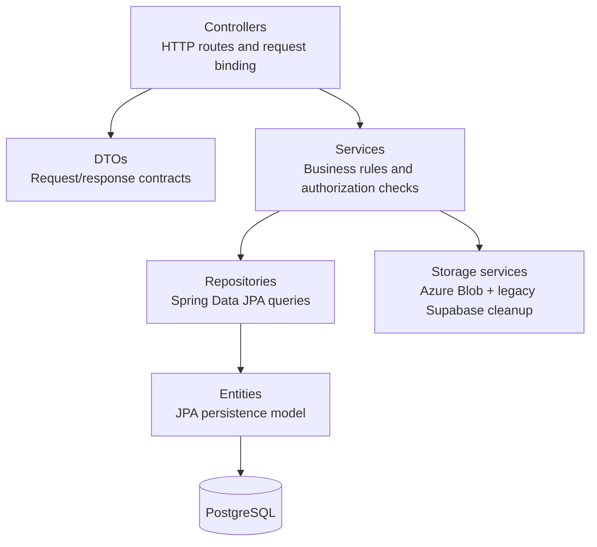

### Backend Modules and Feature Domains

| Domain | Controllers / services | Main responsibility | Source |
|---|---|---|---|
| Health | `HealthController` | Health endpoint at `/health` | Code |
| Users | `UserController`, `UserService` | Current user profile, avatar upload, skills, user lookup | Code |
| Workshops | `WorkshopController`, `WorkshopServiceImpl` | Public workshop listing, creation, detail retrieval, host views, attendance actions | Code |
| Admin workshops | `AdminWorkshopController`, `WorkshopServiceImpl` | Admin list, pending review, detail, update, approve, reject, cancel, image upload | Code |
| Notifications | `NotificationController`, `NotificationServiceImpl` | Notification list, unread count, read status, async notification creation | Code |
| Memory | `MemoryController`, `MemoryServiceImpl` | Public memory list and detail by slug | Code |
| Admin memory | `AdminMemoryController`, `MemoryServiceImpl` | Admin memory CRUD, edit locks, media upload | Code |
| Security/config | `WebSecurityConfiguration`, `JwtConverter`, `CorsConfig` | JWT validation, stateless sessions, CORS, role mapping | Code |
| Storage | `AzureBlobStorageService`, `SupabaseStorageService` | Uploaded media storage and cleanup support | Code |

### Request Handling Lifecycle

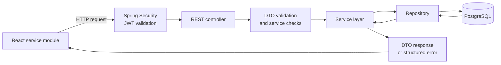

Validation is split across DTO annotations, service methods, and the global exception handler. `GlobalExceptionHandler` converts common validation, authorization, domain, upload, not-found, data integrity, and unexpected exceptions into structured API errors.

### Authentication and Authorization Enforcement

The backend enforces authentication using Spring Security's OAuth2 Resource Server support. The security configuration permits health checks, auth-related routes, public workshop reads, and public memory reads; most `/api/**` routes require authentication.

Admin authorization is implemented through database-backed role mapping:

| Step | Behaviour | Source |
|---|---|---|
| JWT validation | Backend validates JWTs using configured issuer/JWKS settings | Code |
| Local user lookup | Backend maps the JWT subject to `user_account.auth_subject` | Code |
| Role lookup | `JwtConverter` reads the local user's role | Code |
| Admin authority | Role values equivalent to `admin` / `role_admin` map to `ROLE_ADMIN` | Code |
| Enforcement | Admin controllers and services check `ROLE_ADMIN` or equivalent authorities | Code |

Some comments in older backend files still mention Supabase authentication. Current configuration and documentation support Clerk/JWKS validation as the active model.

## 6. Data Architecture

### Database Technology

The application uses PostgreSQL with Spring Data JPA/Hibernate. Deployment documentation describes Azure Database for PostgreSQL Flexible Server for production deployment.

Flyway dependencies and Gradle configuration exist, but `spring.flyway.enabled=false` appears in inspected application properties. Therefore, the current runtime migration process requires verification.

### Main Entities

| Entity | Table | Purpose | Source |
|---|---|---|---|
| `UserAccount` | `user_account` | Internal user record mapped to external authentication subject | Code |
| `UserSkill` | `user_skill` | Skills attached to a user profile | Code |
| `Workshop` | `workshops` | Workshop submissions, review state, schedule, facilitator, logistics, and image URL | Code |
| `WorkshopParticipant` | `workshop_participants` | Attendance relationship between users and workshops | Code |
| `Notification` | `notifications` | User-specific notification messages and read state | Code |
| `MemoryEntry` | `memory_entries` | Markdown memory page content, status, slug, cover, creator/updater, and edit lock metadata | Code |
| `MemoryMedia` | `memory_media` | Media URLs associated with memory entries | Code |

### Entity Relationships

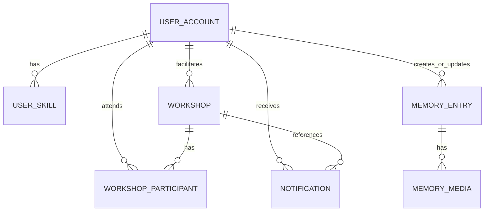

This ER diagram is a high-level view inferred from JPA entity relationships. It intentionally omits implementation details such as individual columns and indexes.

### Data Ownership Model

| Data | Owner / authority | Notes |
|---|---|---|
| User profile | Authenticated user owns their profile fields and avatar | Backend creates/updates the local user record from JWT claims and profile updates |
| User skills | Authenticated user | Users can add and remove their own skills |
| Workshop submission | Facilitator/submitter owns the initial submission | Admins can review and update submissions through admin workflows |
| Workshop review state | Admin user | Approval, rejection, cancellation, and admin image upload are admin-controlled |
| Attendance | Authenticated user | Users join or leave approved/open workshops subject to service checks |
| Notifications | Recipient user | Users can read and mark their own notifications |
| Memory entries | Admin users | Public users can read published memory entries; admin users manage content |
| Uploaded media | Backend-mediated object storage | File URL references are persisted in user, workshop, or memory records |

### Clerk-to-Internal User Mapping

The backend maps Clerk-issued JWT identity to an internal `UserAccount` record.

| Field / concept | Behaviour | Source |
|---|---|---|
| External subject | JWT `sub` is stored in `user_account.auth_subject` | Code |
| External provider | JWT issuer may be stored in `auth_provider` | Code |
| Internal ID | Backend assigns an internal UUID for new users | Code |
| Email/username | Derived from JWT claims where available, with frontend fallback display logic | Code |
| Role | Stored in the local database, not trusted solely from client state | Code |
| Admin mapping | Local role determines `ROLE_ADMIN` authority | Code |

The frontend uses Clerk for session state, but the backend remains responsible for creating or finding the internal user record and enforcing role-based permissions.

## 7. Authentication and Authorization Architecture

### Authentication Provider

Clerk is the current authentication provider according to the frontend integration, backend JWT configuration, and deployment documentation. The backend validates JWTs through configurable issuer/JWKS settings and uses RS256 in current application properties.

### Login and Session Flow

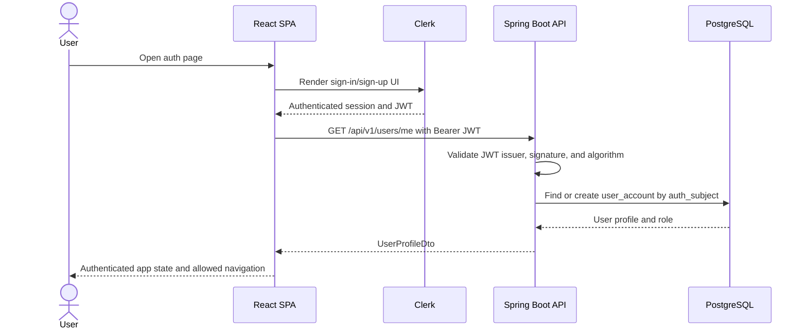

The backend decoder may cache provider metadata/JWKS according to Spring Security behaviour. The diagram shows the trust relationship, not necessarily a network call to Clerk on every request.

### Authenticated API Request Flow

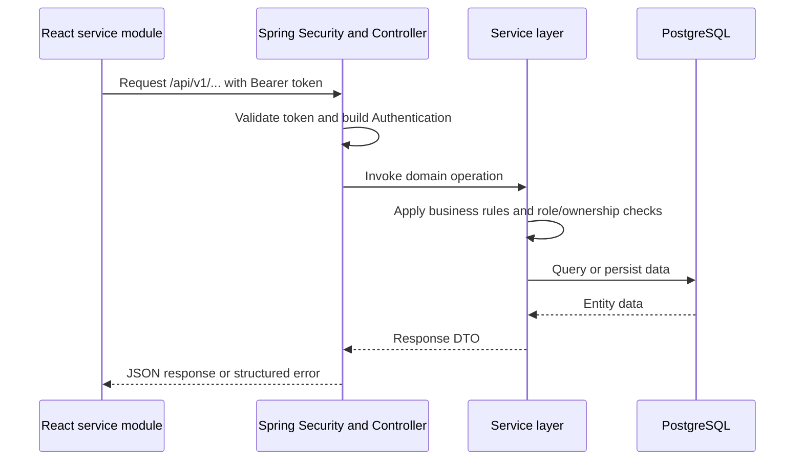

### Role and Permission Model

| Role / access level | Supported capabilities | Source |
|---|---|---|
| Public visitor | View public approved workshops and published memory entries | Code |
| Authenticated member | View current profile, update own profile, upload avatar, create workshops, join/leave workshops, view own hosted/attending workshops, read own notifications | Code |
| Admin user | Access admin workshop review and admin memory management APIs | Code |

The code does not show a separate super-admin, staff hierarchy, audit reviewer, or fine-grained permission matrix. Those roles should not be assumed.

## 8. Media / File Storage Architecture

### Upload Paths

| Upload type | Endpoint / service path | Storage behaviour | Source |
|---|---|---|---|
| User avatar | `/api/v1/users/me/avatar` | Validates image file and stores via Azure Blob service | Code |
| Workshop image | `/api/v1/admin/workshops/{id}/image` | Admin-only image upload; stores via Azure Blob service and updates workshop image URL | Code |
| Memory media | `/api/v1/admin/memories/media` | Admin-only media upload; stores via Azure Blob service and returns media URL/path | Code |

### Storage Behaviour

The active upload services call `AzureBlobStorageService.uploadImage`. The service:

- Validates that storage configuration is present.
- Creates the target blob container if needed.
- Uploads the file stream.
- Sets blob content type headers.
- Returns a blob URL, optionally with a read-only SAS query string if configured.
- Provides deletion helpers for known blob URLs.

Legacy `SupabaseStorageService` remains in the codebase and is used for cleanup compatibility in services that may delete previously stored Supabase URLs. Current documentation positions Azure Blob Storage as the active media storage layer.

### Media References

| Data object | Media reference field | Source |
|---|---|---|
| User profile | `avatar_url` / `avatarUrl` | Code |
| Workshop | `image_url` / response `image` | Code |
| Memory entry | `cover_url` and related `memory_media.media_url` entries | Code |

The frontend resolves stored media URLs through `resolveAssetUrl` and displays them directly. Existing deployment documentation states that media is served from object storage rather than proxied through the backend.

### Media Access Assumptions

Blob read access depends on storage configuration. The backend can return plain blob URLs or SAS URLs based on configuration. Public-read versus private-container behaviour should be verified in the active deployment environment.

The deployment workflow and application properties use different environment variable names for the Azure container setting in the inspected files. The exact production container binding therefore requires verification.

## 9. Core Request and Data Flows

### 9.1 User Login and Profile Bootstrap

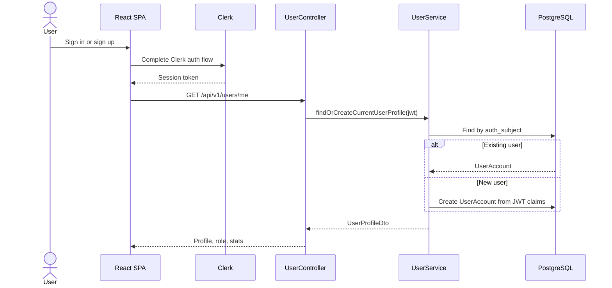

### 9.2 Creating a Workshop

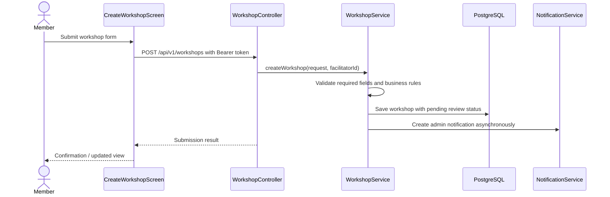

The admin notification step is inferred from service implementation and async notification support.

### 9.3 Joining or Leaving a Workshop

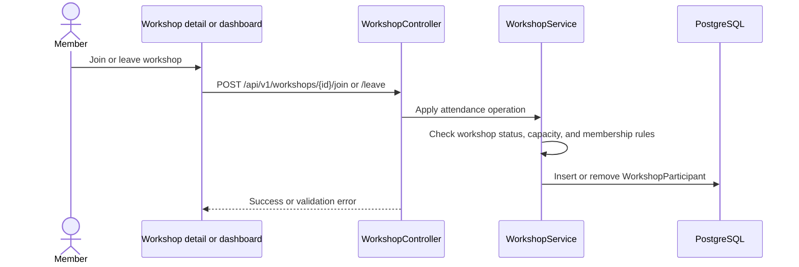

### 9.4 Admin Workshop Review

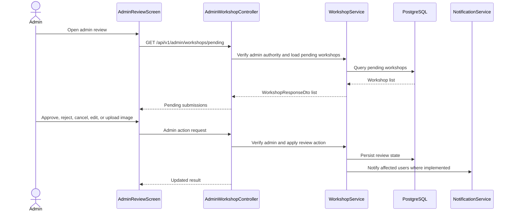

### 9.5 Uploading Media

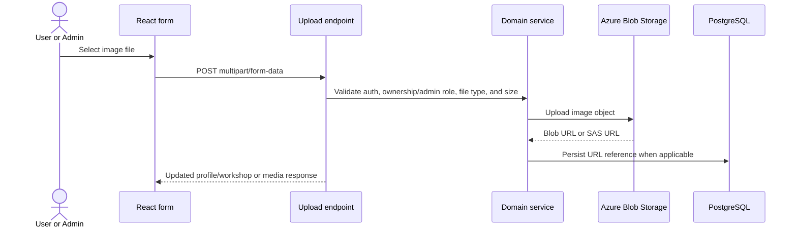

### 9.6 Admin Memory Editing with Locks

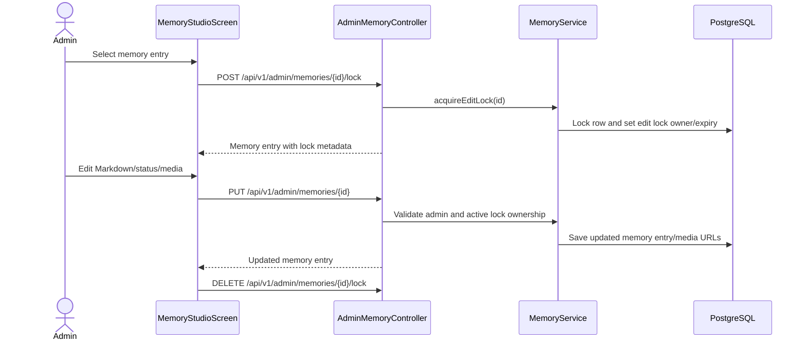

The memory edit mechanism uses pessimistic row locking and explicit lock metadata. This differs from a version-column optimistic locking design; no active JPA `@Version` field was found in the inspected memory entity.

## 10. External Integrations

| Integration | Runtime role | Evidence |
|---|---|---|
| Clerk | Authentication provider, session/JWT issuance, frontend auth UI | Code and existing documentation |
| Azure Database for PostgreSQL | Managed relational database in documented deployment | Existing documentation and application properties |
| Azure Blob Storage | Object storage for uploaded media | Code and existing documentation |
| Vercel | React SPA hosting and frontend HTTPS | Existing documentation and `vercel.json` |
| Azure VM | Docker host for backend application | Existing documentation and workflow |
| Nginx + Let's Encrypt/Certbot | Reverse proxy and TLS termination for backend API | Existing documentation |
| GitHub Actions | Backend build/deploy automation | Workflow files |
| GitHub Container Registry | Backend Docker image registry | Workflow files |
| Supabase storage | Legacy compatibility service remains in backend code | Code |

No external queue, cache, message broker, search engine, analytics platform, application performance monitoring service, or centralised logging service was found in the inspected runtime architecture.

## 11. Deployment Context Summary

Deployment is documented as a split-cloud model:

| Deployment concern | Current documented approach | Source |
|---|---|---|
| Frontend hosting | Vercel serves the React SPA with SPA fallback routing | Existing documentation and `vercel.json` |
| Backend hosting | Spring Boot backend runs as a Docker container on an Azure VM | Existing documentation and Dockerfile |
| Reverse proxy | Nginx handles HTTPS/TLS termination and proxies to the backend container | Existing documentation |
| Database | Azure Database for PostgreSQL Flexible Server | Existing documentation |
| Media storage | Azure Blob Storage | Existing documentation and code |
| Backend CI/CD | GitHub Actions builds the JAR, builds/pushes Docker image to GHCR, SSH redeploys the VM container | Workflow files |
| Container lifecycle | Docker restart policy is configured as `unless-stopped`; container logs are size-limited in the workflow | Workflow files |

This section is intentionally concise. Operational procedures, secrets configuration, DNS/TLS setup, fallback deployment, and troubleshooting belong in the cloud deployment documentation.

## 12. Key Architecture Decisions

| Decision | Rationale | Evidence / status |
|---|---|---|
| Decouple frontend and backend | Allows the React SPA and Spring Boot API to be deployed independently | Code and deployment docs |
| Use Clerk for authentication | Avoids self-hosting password/session infrastructure and delegates token issuance | Code and deployment docs |
| Validate JWTs in the backend | Keeps backend APIs protected even if client state is manipulated | Code |
| Store roles in the local database | Lets application-specific admin access be controlled by internal records | Code |
| Use PostgreSQL as system of record | Fits relational data such as users, workshops, participants, notifications, and memory entries | Code |
| Store media in object storage | Prevents uploaded files from depending on container or VM local disk | Code and deployment docs |
| Use REST API and DTOs | Simple contract between SPA and backend; visible in controllers and frontend services | Code |
| Use a layered backend | Controllers, services, repositories, entities, and DTOs separate transport, business rules, and persistence | Code |
| Deploy backend as Docker on VM | Provides reproducible runtime packaging with relatively simple infrastructure for a small-scale project | Existing documentation and workflow |
| Use GitHub Actions and GHCR for backend releases | Removes manual JAR/image transfer and standardises backend redeploys | Workflow files |
| Use edit locks for memory content | Reduces concurrent admin edit conflicts for memory pages | Code |

Detailed ADRs are not currently present in the inspected repository. Future ADRs could formalise the authentication provider choice, VM-vs-managed-container trade-off, media storage model, and database migration approach.

## 13. Scalability, Reliability, and Maintainability Considerations

### Current Strengths

| Area | Strength | Source |
|---|---|---|
| Frontend delivery | Static SPA deployment can scale independently from backend compute | Existing documentation |
| Backend packaging | Docker image provides repeatable backend runtime packaging | Dockerfile and workflow |
| Backend statelessness | JWT-based auth avoids server-side web sessions | Code |
| Database management | Deployment docs use managed PostgreSQL rather than self-hosted database on VM | Existing documentation |
| Media durability | Uploaded media is stored outside the backend container | Code and existing documentation |
| Code organisation | Frontend feature folders and backend layers improve handover and maintainability | Code |
| Error handling | Global exception handler centralises common API error responses | Code |
| Notifications | Notification creation is asynchronous for relevant backend operations | Code |

### Current Constraints

| Area | Constraint | Status |
|---|---|---|
| Backend high availability | Backend deployment is documented as a single VM/container, not multi-instance or auto-scaling | Current limitation |
| Database migration | Flyway is present but disabled in inspected runtime properties | Requires verification |
| Observability | No centralised metrics, tracing, or external APM integration was found | Current limitation |
| Backup and recovery | Deployment docs discuss database backup/import procedures, but automated backup policy is not verified in code | Requires verification |
| Queueing | Async notifications use Spring async execution, not a durable external message queue | Current limitation |
| Cache/search | No Redis, CDN-backed API cache, or dedicated search service found | Current limitation |
| Test coverage | Build files include test dependencies, but architecture-level automated coverage was not verified in this review | Requires verification |
| Storage configuration | Deployment workflow and application properties appear to use different Azure container environment variable names | Requires verification |
| Configuration hygiene | Build/runtime scripts should avoid printing sensitive configuration previews | Future improvement |

### Future Improvements

These are not currently implemented unless separately verified:

- Move backend hosting from a single VM to a managed container platform or multi-instance deployment.
- Add structured application metrics, tracing, and alerting.
- Confirm and document automated PostgreSQL backup and restore procedures.
- Enable and standardise Flyway migrations for schema changes.
- Add stronger automated integration tests around authentication, admin review, media upload, and memory locks.
- Add a durable queue for notification workflows if volume or reliability needs increase.
- Align Azure Blob container environment variable names across workflow, properties, and documentation.
- Add ADRs for major architectural decisions.

## 14. Known Limitations and Assumptions

| Area | Limitation / assumption | Status |
|---|---|---|
| Feedback/reviews | Feedback route exists as a placeholder only | Directly supported by code |
| Credits | Credit-related fields exist, but frontend comments indicate the credit system is disabled | Partially supported |
| User management | No admin user-management module was found | Unsupported in current code |
| Reports/flags/complaints | No reporting or complaint workflow found | Unsupported in current code |
| Audit logs | No dedicated audit log entity or admin audit screen found | Unsupported in current code |
| Memory concurrency | Edit locks are implemented; active version-based optimistic locking was not found in the inspected entity | Code-supported lock model, not optimistic versioning |
| OAuth providers | Clerk is integrated, but exact enabled providers depend on Clerk project configuration | Requires verification |
| Media privacy | Backend can return plain or SAS URLs; active public/private blob access depends on storage configuration | Requires verification |
| Frontend routing | Internal routing is inferred from `AppContext.tsx` page/path mapping | Inferred from implementation |
| Deployment liveness | Deployment docs and workflows were inspected; live production availability was not verified | Requires verification |
| Database schema lifecycle | JPA validates schema in production-like properties; Flyway runtime migration is disabled in inspected files | Requires verification |

## 15. Verification Notes

### Directly Supported by Code

The following architecture details are directly supported by inspected source code:

- React, TypeScript, Vite frontend structure.
- Clerk frontend integration through `ClerkProvider` and Clerk hooks.
- Internal page/path routing through `AppContext.tsx`.
- Frontend service-layer API pattern using `apiCall`.
- Spring Boot REST controllers under `/api/v1`.
- Backend layered structure with controllers, services, repositories, entities, and DTOs.
- JWT validation through Spring Security OAuth2 Resource Server.
- Database-backed admin role mapping through `JwtConverter`.
- PostgreSQL persistence through Spring Data JPA entities and repositories.
- User, workshop, participant, notification, memory entry, and memory media entities.
- Azure Blob upload service used by avatar, admin workshop image, and admin memory media flows.
- Legacy Supabase storage service remaining for compatibility/cleanup.
- Global exception handling.
- Asynchronous notification creation.
- Memory edit lock support.
- Dockerfile for backend runtime packaging.

### Directly Supported by Existing Documentation or Workflow Files

The following details are supported by cloud deployment docs or workflow files:

- Frontend deployment on Vercel.
- Backend deployment as a Docker container on an Azure VM.
- Nginx reverse proxy and HTTPS/TLS termination.
- Azure Database for PostgreSQL deployment context.
- Azure Blob Storage deployment context.
- GitHub Actions build-and-deploy workflow for backend.
- GHCR usage for backend container image storage.
- Runtime secret injection through deployment systems.

### Inferred from Implementation

The following details are inferred from source behaviour rather than explicitly stated in a single architecture document:

- Frontend state management is React Context plus hooks/local state, with no external global store observed.
- Frontend navigation is an internal page router mapped onto browser history.
- The browser displays media directly from stored blob URLs.
- Workshop creation can trigger admin notification creation.
- Admin memory editing is protected by explicit edit lock ownership/expiry checks.
- Data ownership boundaries are derived from controller/service methods and entity relationships.

### Requires Further Confirmation

The following should be confirmed before treating them as production guarantees:

- Live deployment availability and currently active production URLs.
- Exact active Clerk provider configuration and enabled sign-in methods.
- Exact Azure Blob container name used by production after resolving workflow/property variable naming.
- Automated database backup schedule and recovery point objectives.
- Current schema migration process, because Flyway is present but disabled in inspected properties.
- Current automated test coverage and CI quality gates beyond the backend deploy workflow.
- Whether any monitoring, alerting, or external log aggregation exists outside the inspected repository.
